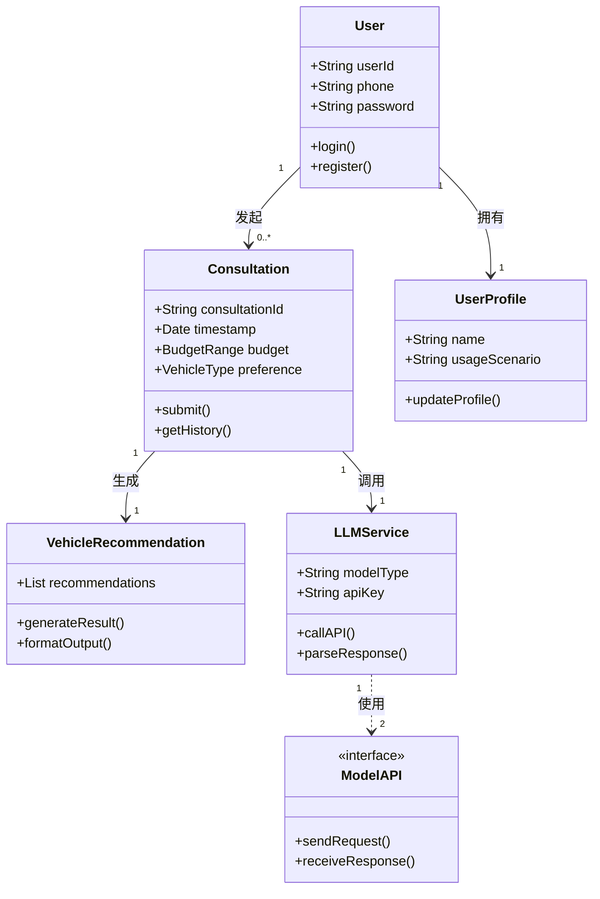

# 购车咨询系统功能需求建模分析

## 一、用例分析

### 1. 参与者（Actor）

- **用户**：普通汽车消费者
- **管理员**：系统维护人员
- **系统**：集成的LLM服务（阿里百炼、智普AI）

### 2. 核心用例图

```
+-------------------+     +---------------------+
|     用户          |     |   管理员            |
+-------------------+     +---------------------+
| 注册/登录         |<----| 查看咨询记录        |
| 发起购车咨询      |     | 管理用户账号        |
| 查看咨询历史      |     +---------------------+
+-------------------+
          ↓
+---------------------------------------------+
|                系统                          |
+---------------------------------------------+
| 调用LLM接口                                 |
| 处理咨询请求                                |
| 生成结构化推荐结果                          |
+---------------------------------------------+
```

### 3. 用例详述

#### 用户用例（基础功能）

| 用例名称 | 触发条件           | 前置条件 | 后置条件         | 关键事件流                                                   |
| -------- | ------------------ | -------- | ---------------- | ------------------------------------------------------------ |
| 发起咨询 | 用户点击"立即咨询" | 已登录   | 生成咨询ID并存储 | 1. 输入预算范围 2. 选择车型偏好 3. 填写使用场景 4.燃料类型偏好 5.品牌偏好 6. 提交咨询请求 7. 显示推荐结果 |
| 查看记录 | 点击"历史记录"     | 已登录   | 加载咨询记录列表 | 1. 查询数据库 2. 显示咨询时间/参数/结果                      |

#### 管理员用例（附加）

| 用例名称 | 触发条件     | 前置条件   | 关键事件流                              |
| -------- | ------------ | ---------- | --------------------------------------- |
| 查看统计 | 进入管理后台 | 管理员身份 | 1. 加载用户行为数据 2. 显示热门咨询参数 |

### 4. 用例关系

- 包含关系

  ：

  - 发起咨询 → 参数收集
  - 发起咨询 → LLM调用

- 扩展关系

  ：

  - 查看记录 → 导出PDF

- 依赖关系

  ：

  - 所有用例均依赖系统认证

## 二、类图分析

### 1. 核心类结构



### 2. 类关系说明

- **User-Consultation**：一对多关系，用户可发起多次咨询
- **Consultation-VehicleRecommendation**：一对一，每次咨询生成唯一推荐结果
- **LLMService-ModelAPI**：实现关系，封装不同模型的调用
- **Consultation-LLMService**：依赖关系，咨询过程需调用LLM服务

### 3. 关键类方法

| 类名                  | 核心方法       | 说明                           |
| --------------------- | -------------- | ------------------------------ |
| Consultation          | submit()       | 验证参数并触发LLM调用          |
| LLMService            | callAPI()      | 封装不同模型的调用逻辑         |
| VehicleRecommendation | formatOutput() | 将JSON结果转换为用户友好的格式 |
| User                  | register()     | 包含手机号格式验证逻辑         |